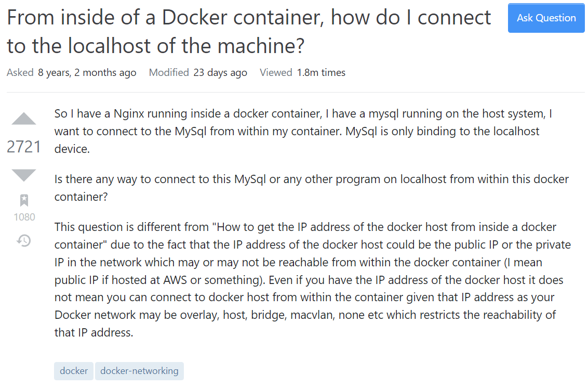
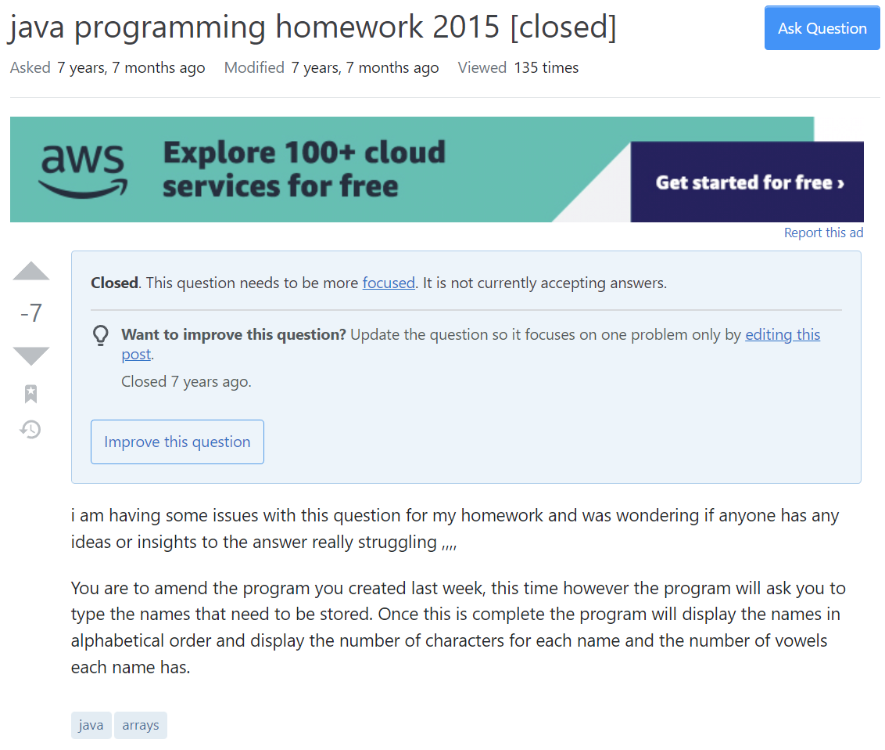
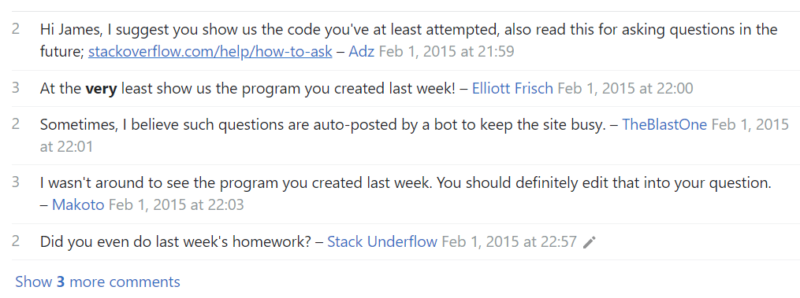

  

  
## Importance of Asking Questions

Nobody knows everything, but everybody knows something. For this reason, it is important for software engineers to be able to ask questions effectively. Communication is one of the most important skills to develop. To ask a question the “smart way” could be the difference between getting a quick definitive answer and being left on read. Before asking a technical question via email or forum, make sure you’ve already exhausted your other resources. These resources include searching archives of forums, reading the manual, asking a friend, and searching the Web. This ensures that you aren’t wasting people’s time. If you still haven’t found anything, it is time to choose where to ask your question. Whether you decide on asking your question via email, forum, or mailing list, make sure it is in a place where it will not be ignored. Then, once you’ve decided on the method, make sure you ask a “smart” question.

## "Smart" Question

Here I’ll be using Stack Overflow posts as examples. In this instance, the user was precise and informative about their problem. The subject header was a clear description of the problem. The format is easy to read and it is obvious that the user did their homework in the third paragraph by mentioning a separate post by another user that could’ve been related back to their own. As a result, the expert responding to this question gave a very detailed answer, essentially making a tutorial for the original poster. This question also appears to be very popular in the community, as it has been viewed 1.8 million times. It also has been bookmarked a thousand times and has almost three thousand upvotes. 

Here is a link to the [post](https://stackoverflow.com/questions/24319662/from-inside-of-a-docker-container-how-do-i-connect-to-the-localhost-of-the-mach/24326540#24326540).

  

## "Not so Smart" Question

In another instance, the user used the subject header to indicate that the problem was their homework in 2015, not a good way to get the experts’ attention. In addition, the problem is asking to modify a program created in a previous week, but the user didn’t include the program in their post. Also, the question has since been closed by an experienced user or moderator as it needs to be more focused. Luckily for this user, before the post got closed, an expert was kind enough to give the user a hint as to how to solve this problem. All in all, a very “not so smart” question. Despite this question having been asked over seven years ago, it has only been viewed 136 times. The question itself has seven downvotes. The original post also has comments below it critiquing the question. One such comment believed that the question was posted by a bot. 

Here is a link to the [post](https://stackoverflow.com/questions/28268414/java-programming-homework-2015).

  
  

## Conclusion

By asking these questions, whether it be on a forum or through email, we are relying on others to take time out of their busy schedules to answer our questions. For this reason, these experts usually need to filter through these questions ruthlessly. As a result, you may get ignored if your question isn’t up to par. Thus, if you have a question, make sure it’s a smart one. By asking a question the “smart way”, you increase your likelihood of getting a swift, helpful response.
