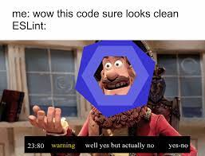
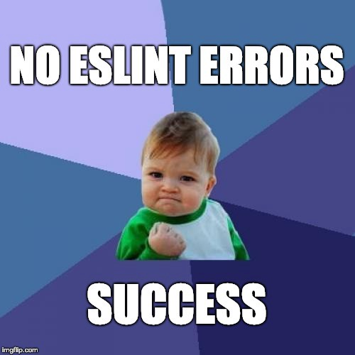

  

## Keep it Clean

To some, coding standards are nothing more than an inconvenience. If it ain’t broke, don’t fix it. Though it’s true that the output would be the same, these programmers vastly overlook the importance of clean, consistent code. Following coding standards make it easier for others to understand code without the original programmer being present to explain it. It improves efficiency as newcomers don’t need an explanation as to what is going on or which parts of the code do what. It also helps with the debugging process. Coding standard errors can be a helpful indicator as to what went wrong.

    

## Experience With ESLint

At the time of writing this, I have used ESLint with IntelliJ IDEA for approximately one week. I find getting the green checkmark to be both painful and useful. First off, I have to say that I’m not the biggest fan of getting errors solely because of missing spaces before and after curly brackets. Loops formatted this way don’t look the cleanest, though I might be biased since I’ve been doing it differently throughout my entire coding career. However, I understand the importance of formatting my code according to the set standards. Seeing the different ways that I can make my programs more efficient helps to further develop my JavaScript skills.

## Conclusion

Though coding standards can be seen as a hassle, they can also assist in improving the readability and efficiency of your code. This is very important when it comes to maintenance and improving old code. While quality assurance tools, such as ESLint, can be used as enforcers of coding standards, they can also be used to help in understanding programming languages better.

    

