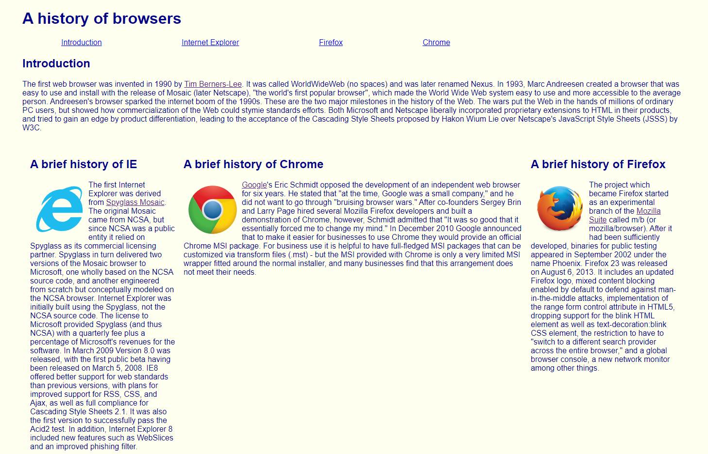
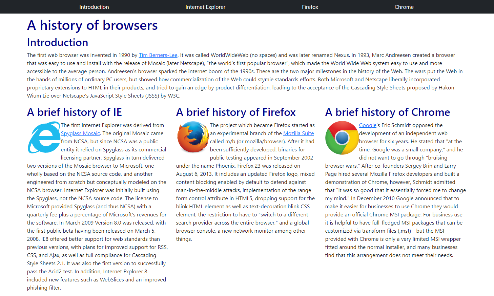
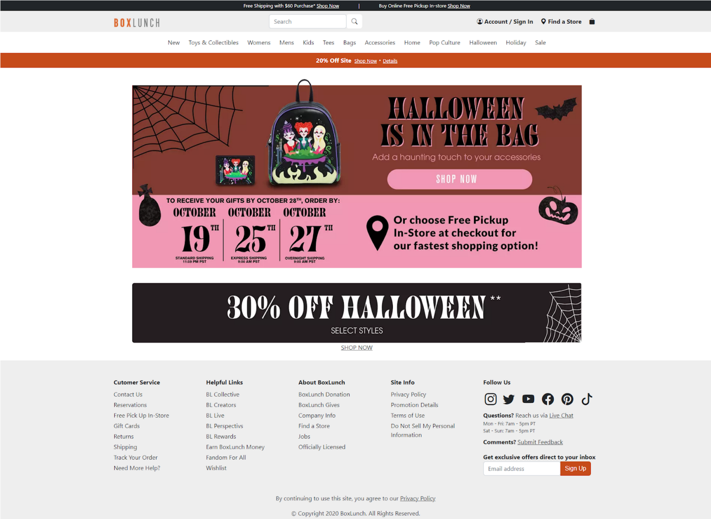

## What is a UI Framework?

UI frameworks help to build multi-device applications without requiring the user to have immense technical knowledge. Using these frameworks saves developers from having to build apps completely from scratch. They contain pre-built components that help create good-looking and responsive layouts. These frameworks are very user-friendly, allowing anyone to start creating a website with minimal knowledge.

## Learning Bootstrap 

I am currently learning how to use Bootstrap 5. Bootstrap is a powerful, extensible, and feature-packed frontend toolkit. I have to admit, trying to learn all the different features and how to effectively use them together is like pulling teeth, but I know that it will benefit me in the long run. In the brief period of time that I’ve used this framework, it has allowed me to create better looking websites using less code within a shorter time frame.  

  

## Why Not Use HTML and CSS?

Raw HTML and CSS are very limited in what it can accomplish. It takes a lot of time and effort to create a decent looking website without a UI framework. Below are two websites: one only uses HTML and CSS, the other uses Bootstrap 5.

    

### Website 1: HTML + CSS

    

This website only uses HTML and CSS. HTML allows you to add content and the structure of that content. It includes text, links, and photos. CSS lets you style and layout the webpage. It encompasses fonts, colors, sizes, and spacing. Overall, the design of this website isn’t pretty. Only the middle column changes with the window size, the outer columns remain the same.

### Website 2: Bootstrap 5

    

This website uses Bootstrap 5. In addition to looking better and including a navbar, it also helps simplify the HTML code and offers better performance using few lines of code. Overall, the design of this website is much nicer than Website 1. In addition, all the columns on this website adjust with the window size, so no one column is wider than another.

## Recreating BoxLunch.com

    

This is a mock website of [BoxLunch.com](https://www.boxlunch.com/) that I created using Bootstrap 5. While designing the website, I ran into quite a few problems, such as creating search bars, aligning text, and sizing icons. It was hard to remember which classes did what, so I had to keep clicking through tabs of documentation. However, Bootstrap made my life so much easier and allowed me to make my website fairly similar to the original. This website was created after only a few days of exposure to Bootstrap 5. Overall, I see many benefits for using Bootstrap 5. It allows developers to create beautiful and responsive websites, while also being user-friendly.
