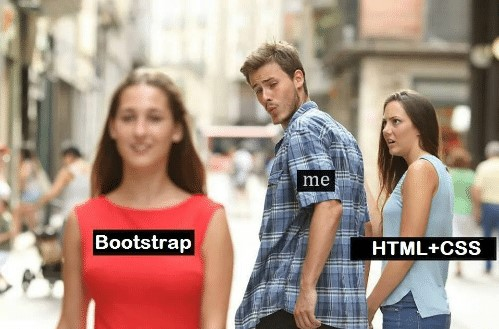

  

## What is a UI Framework?

## Learning Bootstrap 

    

## Why Not Use HTML and CSS?

    

### Website 1: HTML + CSS

    

### Website 2: Bootstrap 5

    

## Recreating BoxLunch.com

    

This is a mock website of [BoxLunch.com](https://www.boxlunch.com/) that I created using Bootstrap 5. While designing the website, I ran into quite a few problems, such as creating search bars, aligning text, and sizing icons. It was hard to remember which classes did what, so I had to keep clicking through tabs of documentation. However, Bootstrap made my life so much easier and allowed me to make my website fairly similar to the original. This website was created after only a few days of exposure to Bootstrap 5. Overall, I see many benefits for using Bootstrap 5. It allows developers to create beautiful and responsive websites, while also being user-friendly.
