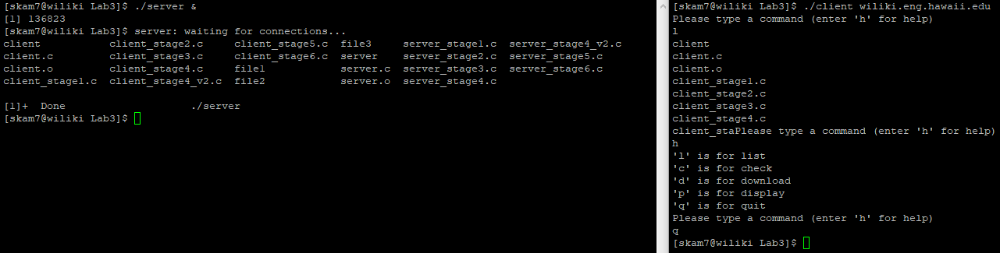

The objective of this assignment was to gain experience with the client server paradigm, processes, system calls, how data is transported over the Internet, and communication between processes. We needed to write a simple client server system. This was my introduction to clients and servers. 

Our client was able to continually accept commands until the user quits. The commands included listing the continents of the directory of the server, checking if a certain file exists in the server, displaying a certain file if it exists, downloading a specific file, terminating the client program, and a listing of all the possible commands.

This lab helped me better understand how clients and servers communicate with one another. I also learned to avoid zombie processes.

[My Code](https://github.com/shannonkam/EE367-Client-Server-Lab)
