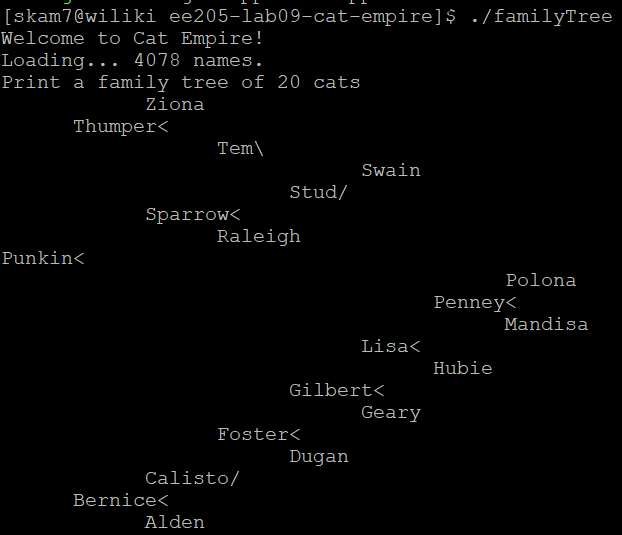
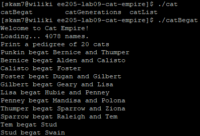

For this project, we needed to create and display a list of cats in multiple ways. Collection classes are containers for objects. Data structures that underpin the container determine how well it will scale and how long it will take to perform certain functions. For this reason, we used two classes to create the cat empire. The first class included all the data, keys, and structure for each cat. The second class managed the data in a binary search tree that holds all the cats. 

The final product produced the information in various ways. One option was to print a family tree of cats using an in-order reverse depth first search. Using this method, the family tree was printed on its side. Another option was to print a pedigree of cats using a preorder depth first search. Another way the information was printed was by generation. This required a breadth-first search that tracks depth. The last option was to print the cats in an alphabetized list.

In completing this lab, I strengthened my knowledge of pointers, binary search trees, and tree traversal. 

[My Code](https://gitlab.com/skam7/ee205-lab09-cat-empire.git)
