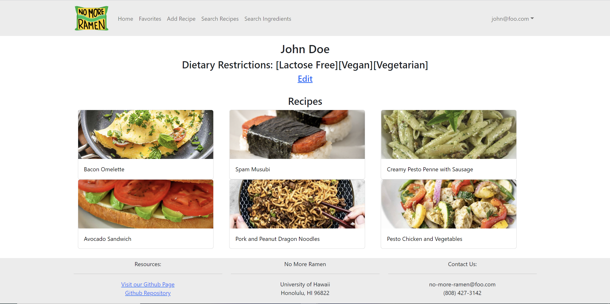
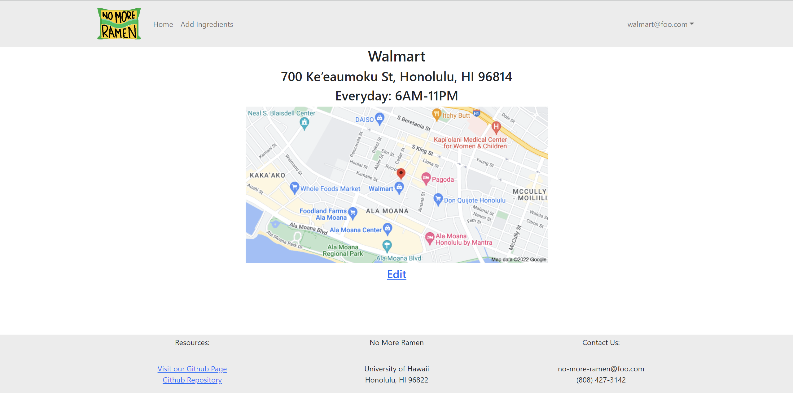

College students are usually price-sensitive and have limited kitchen resources. As a result, students end up eating fast food products or vending machine snacks.

The goal of this site is to help improve the nutritional content and variety of foods eaten by students. This web application allows students to find and share recipes that adhere to a student budget as well as helps vendors advertise their ingredients.

As a student, you can submit recipes for other students to see. There is a search function that allows you to filter through every recipe on the site based on your dietary restrictions, desired serving size, etc. You are also able to search for any ingredients you may need and figure out the vendor to acquire it from. As a vendor, you can submit ingredients that you carry, indicating price and amount in stock.

My contributions to this project mainly included creating the profile pages for students and vendors. For students, the profile page showed the student’s name, dietary restrictions, and all the recipes that the student submitted.

  

For vendors, it showed the vendor’s name, address, hours of operation, and an image that shows the vendor’s location. Both students and vendors are able to update their profiles using an edit button.

  

I learned a lot about web development from this project. On the front-end side, I was able to design an easy-to-use user interface that accepted data from a user and sent it back to the server. This data was then displayed in an easy to read format. On the back-end side, I was able to use MongoDB to store student and vendor data, and send it to the front-end whenever necessary.

[Project Home Page](https://no-more-ramen.github.io/)
